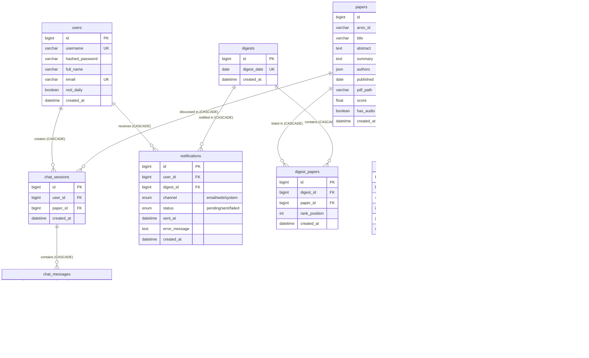

# 03. Thiết kế cơ sở dữ liệu (Database Design)

Tài liệu này mô tả chi tiết thiết kế cơ sở dữ liệu MySQL chuẩn hóa cho hệ thống **AI Paper Multi-Agent System**.

---

## 📊 Sơ đồ thực thể liên kết (Mermaid ERD)

Dưới đây là sơ đồ mối quan hệ giữa 10 bảng trong hệ thống:

---

## 📋 Chi tiết các bảng (Tables Metadata)

### 1. Bảng `users`
- **Mục đích**: Quản lý tài khoản người dùng và nhận thông báo hàng ngày.
- **Khóa chính**: `id` kiểu `BIGINT`.
- **Cột `noti_daily`**: Kiểu `BOOLEAN`, mặc định `TRUE` (server_default `'true'`).

### 2. Bảng `papers`
- **Mục đích**: Lưu trữ thông tin bài báo khoa học cào từ arXiv.
- **Cột `published`**: Kiểu `DATE`, lưu ngày phát hành bài viết trên arXiv (index).
- **Lưu ý**: Đường dẫn tài liệu PDF được lưu trong `pdf_path` là đường dẫn tương đối (relative path). Không lưu trực tiếp nội dung file nhị phân vào DB. Không chứa cột `pdf_url` và `updated_at`.

### 3. Bảng `digests`
- **Mục đích**: Bản tin tổng hợp top 5 bài viết nổi bật hàng ngày.
- **Cột `digest_date`**: Kiểu `DATE` độc nhất (`UNIQUE`), làm index tìm kiếm.

### 4. Bảng `digest_papers` (Bảng trung gian)
- **Mục đích**: Ánh xạ nhiều-nhiều giữa Digests và Papers.
- **Cột `rank_position`**: Thứ hạng trending trong ngày của bài báo (giá trị từ 1 đến 5).
- **Ràng buộc**:
  - `CONSTRAINT uq_digest_paper`: Unique kép `(digest_id, paper_id)`.
  - `CONSTRAINT uq_digest_rank`: Unique kép `(digest_id, rank_position)`.
  - `CONSTRAINT chk_rank_position`: CheckConstraint `rank_position BETWEEN 1 AND 5`.
- **Khóa ngoại**: Cascade delete và update (`ON DELETE CASCADE ON UPDATE CASCADE`).

### 5. Bảng `audio_abstracts`
- **Mục đích**: Lưu trữ file âm thanh tóm tắt hoàn chỉnh của một bài viết.
- **Thiết kế quan hệ 1-1**:
  - Cột `paper_id` được đặt là **`UNIQUE`** và NOT NULL.
  - Mỗi bài viết (`paper`) chỉ liên kết với tối đa một file âm thanh tóm tắt học thuật cuối cùng (`audio_abstract`).
  - Nếu Agent TTS cần phân mảnh hay xử lý âm thanh theo từng block nhỏ (chunk/segment), logic phân đoạn này được thực hiện nội bộ và thông tin mốc thời gian (timestamps) của các chunk được lưu tập trung trong cột `paper_timestamps` (JSON format). Không sử dụng bảng segments riêng.
- **Khóa ngoại**: Cascade delete/update trỏ đến `papers(id)`.

### 6. Bảng `chat_sessions`
- **Mục đích**: Phiên hội thoại hỏi đáp Q&A giữa người dùng và bài báo.
- **Khóa ngoại**: Khóa ngoại `user_id` và `paper_id` đều được đánh index phục vụ truy vấn lịch sử chat nhanh.

### 7. Bảng `chat_messages`
- **Mục đích**: Chi tiết các câu hỏi và câu trả lời trong phiên chat.
- **Cột `role`**: Kiểu dữ liệu `sa.Enum` có các giá trị: `user`, `assistant`, `system`.
- **Cột `tts_path`**: Đường dẫn tương đối file audio phát âm của tin nhắn (nếu có).

### 8. Bảng `topics`
- **Mục đích**: Phân loại các chủ đề công nghệ AI đang nổi bật (`name` unique và index).

### 9. Bảng `paper_topics` (Bảng trung gian)
- **Mục đích**: Ánh xạ bài báo vào chủ đề công nghệ.
- **Ràng buộc**:
  - `uq_paper_topic`: Unique kép `(paper_id, topic_id)`.
  - `chk_confidence_score`: CheckConstraint `confidence_score >= 0 AND confidence_score <= 1`.

### 10. Bảng `notifications`
- **Mục đích**: Nhật ký gửi thông báo hằng ngày.
- **Ràng buộc**:
  - `digest_id` là `NOT NULL` và có cascade.
  - `uq_user_digest_channel`: Unique trên 3 cột `(user_id, digest_id, channel)`.
  - `channel` dùng Enum: `email`, `web`, `system`.
  - `status` dùng Enum: `pending`, `sent`, `failed`.

---

## ⚡ Danh sách các Index được tối ưu hóa

Hệ thống tự động thiết lập các chỉ mục sau để tăng tốc độ truy vấn:
1. `idx_papers_arxiv_id` (Unique index tự động trên `papers.arxiv_id`)
2. `idx_papers_published` (Index thường trên `papers.published`)
3. `idx_papers_score` (Index thường trên `papers.score`)
4. `idx_papers_created_at` (Index thường trên `papers.created_at`)
5. `idx_digest_papers_digest_id` (Index trên khóa ngoại `digest_papers.digest_id`)
6. `idx_digest_papers_paper_id` (Index trên khóa ngoại `digest_papers.paper_id`)
7. `idx_digest_papers_rank_position` (Index trên `digest_papers.rank_position`)
8. `idx_chat_sessions_user_id` (Index trên khóa ngoại `chat_sessions.user_id`)
9. `idx_chat_sessions_paper_id` (Index trên khóa ngoại `chat_sessions.paper_id`)
10. `idx_chat_messages_session_id` (Index trên khóa ngoại `chat_messages.chat_session_id`)
11. `idx_chat_messages_created_at` (Index trên `chat_messages.created_at`)
12. `idx_paper_topics_paper_id` (Index trên khóa ngoại `paper_topics.paper_id`)
13. `idx_paper_topics_topic_id` (Index trên khóa ngoại `paper_topics.topic_id`)
14. `idx_notifications_user_id` (Index trên khóa ngoại `notifications.user_id`)
15. `idx_notifications_digest_id` (Index trên khóa ngoại `notifications.digest_id`)
16. `idx_notifications_status` (Index trên `notifications.status`)
17. `idx_notifications_sent_at` (Index trên `notifications.sent_at`)
