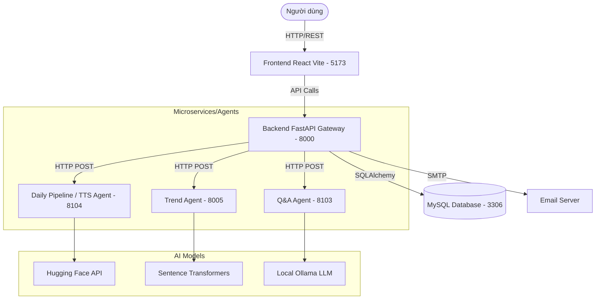
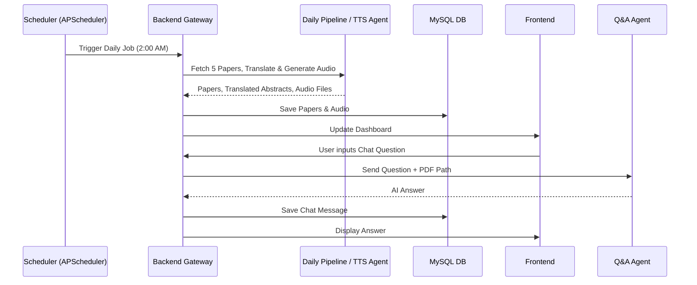

# BÁO CÁO HỆ THỐNG MULTI-AGENT AI PAPERS

## 1. Tổng quan hệ thống

* **Hệ thống này giải quyết bài toán gì?**
  Hệ thống tự động hóa hoàn toàn việc thu thập, phân tích, dịch thuật, tổng hợp và cung cấp khả năng hỏi đáp (Q&A) trên các bài báo nghiên cứu AI mới nhất từ Hugging Face. Hệ thống giúp giải quyết rào cản ngôn ngữ, thời gian và sự quá tải thông tin cho những người làm nghiên cứu hoặc kỹ sư AI.

* **Người dùng cuối sử dụng hệ thống để làm gì?**
  Người dùng cuối (sinh viên, nhà nghiên cứu, kỹ sư) truy cập hệ thống để: 
  - Xem danh sách Top 5 bài báo AI nổi bật nhất mỗi ngày.
  - Đọc tóm tắt bài báo bằng tiếng Việt.
  - Nghe audio tóm tắt (Podcast) thay vì phải đọc.
  - Chat trực tiếp với bài báo (Q&A/RAG) để hỏi sâu về phương pháp, kết quả nghiên cứu.
  - Xem bản đồ xu hướng (Trend Map) để biết các chủ đề AI nào đang hot.

* **Vì sao hệ thống được gọi là Multi-Agent?**
  Hệ thống áp dụng kiến trúc Multi-Agent (Đa tác tử). Thay vì một khối Monolith (đơn khối) xử lý tất cả, hệ thống chia nhỏ các nhiệm vụ AI phức tạp thành các "Agent" (Tác tử) độc lập. Mỗi Agent là một service riêng biệt (microservice) đảm nhận một chuyên môn (Dịch thuật, Text-to-Speech, Phân tích Trend, Q&A) và giao tiếp với nhau qua API.

* **Các thành phần chính gồm những gì?**
  * **Frontend**: Giao diện người dùng web (React, Vite).
  * **Backend Gateway/API**: Máy chủ trung tâm (FastAPI) lưu trữ dữ liệu, xác thực và điều phối Agent.
  * **Database**: MySQL lưu thông tin user, paper, chat, audio, topic.
  * **Daily Paper Audio Pipeline**: Tác tử tổng hợp, dịch thuật và lấy bài báo từ Hugging Face.
  * **Trend Agent**: Tác tử phân tích xu hướng và gom cụm chủ đề (Clustering).
  * **Q&A Agent**: Tác tử RAG sử dụng Ollama LLM để trả lời câu hỏi dựa trên nội dung PDF.
  * **TTS Agent**: Tác tử chuyển đổi văn bản tóm tắt thành giọng nói.
  * **Scheduler/Daily Digest**: Trình lên lịch chạy tự động lấy bài lúc 2 giờ sáng.
  * **Email/Notification**: Gửi email tổng hợp hằng ngày cho người dùng đăng ký.

* **Mô tả ngắn gọn luồng tổng thể**:
  Scheduler (hoặc người dùng) → Backend Gateway → Gọi Daily Pipeline (kéo paper, dịch) → Gọi TTS Agent (sinh audio) → Gọi Trend Agent (tạo topic) → Lưu Database → Frontend hiển thị. Khi user chat → Backend gọi Q&A Agent → Frontend hiển thị câu trả lời.

---

## 2. Công nghệ sử dụng

| Thành phần | Công nghệ | Port | File cấu hình | Vai trò |
|---|---|---|---|---|
| **Frontend** | React 19, Vite, TypeScript, TailwindCSS, Axios, React Router, React Force Graph 2D | 5173 | `frontend/package.json`, `frontend/.env` | Trình diễn giao diện, tương tác người dùng |
| **Backend Gateway** | FastAPI, SQLAlchemy, Alembic, PyMySQL, JWT (passlib), APScheduler | 8000 | `backend/requirements.txt`, `backend/.env` | Điều phối, API Server, Database ORM |
| **Database** | MySQL 8.0 | 3306 | `docker-compose.yml` | Lưu trữ dữ liệu hệ thống vĩnh viễn |
| **Trend Agent** | FastAPI, Sentence-Transformers, UMAP, HDBSCAN | 8005 | `agents/trend_agent/requirements.txt` | Gom cụm, phân tích Topic bài báo |
| **Q&A Agent** | FastAPI, Ollama (Llama/Qwen), FAISS, Nomic-embed-text | 8103 | `agents/qa_agent/requirements.txt`, `agents/qa_agent/.env` | RAG, truy xuất và sinh câu trả lời |
| **Pipeline & TTS** | FastAPI, VinAI Translate, VieNeu TTS (Hugging Face) | 8104 | `agents/daily_paper_audio_pipeline/requirements.txt` | Kéo bài, dịch thuật, sinh Audio (TTS) |

---

## 3. Kiến trúc tổng thể

### 3.1 Sơ đồ component tổng thể



### 3.2 Sơ đồ luồng dữ liệu (Data Flow)



---

## 4. Cấu trúc thư mục source code

| Đường dẫn | Chức năng | Ghi chú quan trọng |
|---|---|---|
| `frontend/` | Chứa mã nguồn giao diện React | Dùng Vite build, TailwindCSS style |
| `frontend/src/pages/` | Các màn hình chính | DashboardPage, PaperDetailPage, TrendsPage |
| `backend/app/main.py` | Điểm khởi đầu của Backend | Mount routers, khởi tạo Scheduler |
| `backend/app/api/v1/` | Các Controller xử lý API | `paper_routes.py`, `chat_routes.py`, `trend_routes.py` |
| `backend/app/db/models/` | SQLAlchemy ORM Models | Ánh xạ với các bảng trong MySQL |
| `agents/trend_agent/` | Microservice Trend | Dùng UMAP, HDBSCAN để phân tích từ khoá |
| `agents/qa_agent/` | Microservice Q&A | Nhúng RAG pipeline dùng FAISS và Ollama |
| `agents/daily_paper_audio_pipeline/` | Microservice Pipeline & TTS | Tải bài, dịch bằng VinAI, TTS VieNeu |
| `scripts/` | Shell/Batch scripts | Chứa `run_all.bat`, `setup_env.bat`, `reset_db.sql` |
| `data/paper_pdf/` | Thư mục lưu file PDF | Được tải về thông qua PDF Download Service |
| `data/audio_abstract/` | Thư mục lưu file Audio | Chứa file âm thanh tóm tắt tiếng Việt |

---

## 5. Frontend

### 5.1 Vai trò của Frontend
Frontend giúp người dùng tương tác trực tiếp với dữ liệu AI. Các trang chính gồm:
* **Home/Dashboard**: Bảng điều khiển xem Top 5 bài báo mới nhất trong ngày.
* **Paper Detail**: Trang đọc tóm tắt bài báo, tích hợp trình phát Audio (nghe tóm tắt) và khung Chat (Q&A).
* **Trends**: Bản đồ bong bóng 2D hiển thị các cụm chủ đề AI đang hot.

### 5.2 Cấu trúc frontend
| File/Component | Vai trò | API gọi đến | Dữ liệu hiển thị |
|---|---|---|---|
| `src/pages/DashboardPage.tsx` | Trang chủ | `/api/v1/digests/latest` | Danh sách bài báo xếp hạng 1-5 |
| `src/pages/PaperDetailPage.tsx` | Trang chi tiết | `/api/v1/papers/{id}`, `/api/v1/chat/messages` | Thông tin bài, Audio player, Chat UI |
| `src/pages/TrendsPage.tsx` | Trang xu hướng | `/api/v1/trend` | Bản đồ mạng nhện các chủ đề AI |
| `src/components/chat/ChatMessageBubble.tsx` | UI tin nhắn | N/A | Tin nhắn của User và AI |

### 5.3 Routing
| Route | Page component | Chức năng |
|---|---|---|
| `/` | `DashboardPage` | Xem Daily Digest |
| `/paper/:id` | `PaperDetailPage` | Đọc bài, Nghe Audio, Chat Q&A |
| `/trends` | `TrendsPage` | Xem bản đồ Trend 2D |

### 5.4 API client của Frontend
* **Base URL**: Cấu hình trong `frontend/.env` qua `VITE_API_BASE_URL` (thường là `http://localhost:8000/api/v1`).
* Frontend dùng Axios instance có sẵn tại `src/services/api.ts` để gọi Backend.

| Chức năng FE | Method | Endpoint BE | Request | Response | File FE gọi API |
|---|---|---|---|---|---|
| Lấy digest | GET | `/api/v1/digests/latest` | N/A | List DigestPaper | `api.ts` |
| Chat với bài báo | POST | `/api/v1/chat/messages` | `{session_id, question}` | Answer, Sources | `PaperDetailPage.tsx` |
| Lấy Trend | GET | `/api/v1/trend` | N/A | Graph Nodes & Links | `TrendsPage.tsx` |

---

## 6. Backend

### 6.1 Vai trò Backend
Backend đóng vai trò API Gateway, điểm chạm duy nhất của Frontend. Backend lưu trữ Database, xác thực JWT, lên lịch chạy Daily Pipeline, và phân phối request tính toán cực nhọc cho các Agent.

### 6.2 Cấu trúc backend
| File/Thư mục | Vai trò |
|---|---|
| `app/main.py` | Khởi tạo FastAPI, CORS, Scheduler (`run_daily_paper_pipeline_job`) |
| `app/api/v1/chat_routes.py` | Xử lý logic Chat, kiểm tra phiên, gọi Q&A Agent |
| `app/services/trend_service.py` | Lấy papers từ DB, gửi cho Trend Agent, lưu Topic |
| `app/jobs/daily_paper_job.py` | Chạy nền tải PDF, dịch, sinh Audio, gửi Email |

### 6.3 Backend API (Các endpoint quan trọng)
| Nhóm | Method | Endpoint | Request body/query | Response | File xử lý |
|---|---|---|---|---|---|
| Papers | GET | `/papers/{id}` | N/A | Paper, Audio, Topics | `paper_routes.py` |
| Chat | POST | `/chat/messages` | `question`, `session_id` | AI Answer | `chat_routes.py` |
| Trend | GET | `/trend` | N/A | UMAP Graph, Topics | `trend_routes.py` |
| Job | POST | `/dev/run-digest` | N/A | Job Stats | `dev_routes.py` |

---

## 7. Các Agent trong hệ thống

### 7.1 Daily Paper Audio Pipeline (TTS Agent)
* **Vai trò**: Lấy 5 bài báo từ Hugging Face Daily Papers, dịch sang tiếng Việt (VinAI Translate) và sinh giọng đọc AI (VieNeu TTS).
* **Công nghệ**: FastAPI, `vinai-translate-en2vi-v2`, `VieNeu-TTS-v3-Turbo`.
* **Backend gọi ở đâu**: Nằm trong file `app/jobs/daily_paper_job.py`, được chạy nền hằng ngày.

### 7.2 Trend Agent
* **Vai trò**: Gom cụm các bài báo để phát hiện "trend" (Ví dụ: LLM, RAG).
* **Công nghệ**: FastAPI, `sentence-transformers`, `UMAP` (hạ chiều), `HDBSCAN` (Clustering).
* **Workflow**: Backend gửi list text bài báo → Trend Agent nhúng embedding → Hạ xuống không gian 2D (umap_x, umap_y) → Gom cụm → Trả về tọa độ 2D và Keyword cho Backend.

### 7.3 Q&A Agent
* **Vai trò**: Chat với nội dung file PDF.
* **Công nghệ**: FastAPI, Ollama (Qwen/Llama), FAISS, Nomic-embed-text.
* **Workflow**: Nhận câu hỏi → Nhúng câu hỏi → Tìm đoạn text tương đồng trong FAISS Index → Ném context cho Ollama sinh câu trả lời → Trả về Backend. Cổng gọi nội bộ tại `backend/app/services/qa_client.py` với timeout 620 giây.

---

## 8. Workflow toàn hệ thống

### 8.1 Workflow Daily Digest & Audio (Tự động lúc 2:00 sáng)
1. **APScheduler** trong Backend kích hoạt `run_daily_paper_pipeline_job`.
2. Pipeline kết nối API Hugging Face tải 5 bài trending mới nhất.
3. Pipeline chuyển Abstract tiếng Anh vào mô hình VinAI để dịch sang tiếng Việt.
4. Pipeline đẩy tiếng Việt sang VieNeu TTS để tạo ra file âm thanh `.wav`.
5. Backend gọi `pdf_download_service.py` để tải file PDF gốc về `data/paper_pdf/`.
6. Backend lưu toàn bộ DB: `papers`, `digest_papers`, `audio_abstracts`.
7. Backend kích hoạt `NotificationService` gửi Email bản tin cho User.

### 8.2 Workflow Q&A (Hỏi đáp với AI)
1. Người dùng mở bài báo, gõ câu hỏi: "Bài này đóng góp gì?"
2. Frontend gọi POST `/api/v1/chat/messages` lên Backend.
3. Backend kiểm tra phiên chat, lưu câu hỏi của User vào DB `chat_messages`.
4. Backend lấy đường dẫn PDF và History gọi POST `http://localhost:8103/qa/ask` tới Q&A Agent.
5. Q&A Agent dùng RAG (Ollama) tìm kiếm trong PDF và sinh ra câu trả lời.
6. Q&A Agent trả response về Backend.
7. Backend lưu câu trả lời vào DB dưới dạng `assistant` và gửi ngược lại Frontend.

---

## 9. Cơ sở dữ liệu

### 9.1 Database dùng gì?
Sử dụng **MySQL 8.0**. Kết nối thông qua SQLAlchemy ORM trong `backend/app/db/database.py`.

### 9.2 Script SQL Đầy đủ (Từ `reset_db.sql`)

```sql
-- Full database schema
CREATE TABLE users (
    id BIGINT AUTO_INCREMENT PRIMARY KEY,
    username VARCHAR(100) NOT NULL UNIQUE,
    hashed_password VARCHAR(255) NOT NULL,
    email VARCHAR(150) NOT NULL UNIQUE,
    noti_daily BOOLEAN NOT NULL DEFAULT TRUE,
    created_at DATETIME NOT NULL DEFAULT CURRENT_TIMESTAMP
);

CREATE TABLE papers (
    id BIGINT AUTO_INCREMENT PRIMARY KEY,
    external_id VARCHAR(50) NOT NULL UNIQUE,
    title TEXT NOT NULL,
    abstract_en TEXT NOT NULL,
    abstract_vi TEXT,
    pdf_path VARCHAR(500),
    has_audio BOOLEAN NOT NULL DEFAULT FALSE,
    created_at DATETIME NOT NULL DEFAULT CURRENT_TIMESTAMP
);

CREATE TABLE digests (
    id BIGINT AUTO_INCREMENT PRIMARY KEY,
    digest_date DATE NOT NULL UNIQUE
);

CREATE TABLE digest_papers (
    id BIGINT AUTO_INCREMENT PRIMARY KEY,
    digest_id BIGINT NOT NULL,
    paper_id BIGINT NOT NULL,
    rank_position INT NOT NULL,
    FOREIGN KEY (digest_id) REFERENCES digests(id),
    FOREIGN KEY (paper_id) REFERENCES papers(id)
);

CREATE TABLE audio_abstracts (
    id BIGINT AUTO_INCREMENT PRIMARY KEY,
    paper_id BIGINT NOT NULL UNIQUE,
    file_path VARCHAR(500) NOT NULL,
    FOREIGN KEY (paper_id) REFERENCES papers(id)
);

CREATE TABLE chat_sessions (
    id BIGINT AUTO_INCREMENT PRIMARY KEY,
    user_id BIGINT NOT NULL,
    paper_id BIGINT NOT NULL,
    FOREIGN KEY (user_id) REFERENCES users(id),
    FOREIGN KEY (paper_id) REFERENCES papers(id)
);

CREATE TABLE chat_messages (
    id BIGINT AUTO_INCREMENT PRIMARY KEY,
    chat_session_id BIGINT NOT NULL,
    role ENUM('user', 'assistant', 'system') NOT NULL,
    content TEXT NOT NULL,
    FOREIGN KEY (chat_session_id) REFERENCES chat_sessions(id)
);

CREATE TABLE topics (
    id BIGINT AUTO_INCREMENT PRIMARY KEY,
    name VARCHAR(255) NOT NULL UNIQUE,
    description TEXT
);

CREATE TABLE paper_topics (
    id BIGINT AUTO_INCREMENT PRIMARY KEY,
    paper_id BIGINT NOT NULL,
    topic_id BIGINT NOT NULL,
    confidence_score FLOAT NOT NULL,
    FOREIGN KEY (paper_id) REFERENCES papers(id),
    FOREIGN KEY (topic_id) REFERENCES topics(id)
);
```

### 9.3 Giải thích các bảng quan trọng
* `papers`: Lưu thông tin lõi (Title, Abstract EN/VI, file PDF path). `has_audio` báo hiệu đã có âm thanh chưa.
* `audio_abstracts`: Liên kết 1-1 với `papers`. Chứa đường dẫn file `.wav`.
* `digest_papers`: Liên kết n-n giữa `digests` (ngày tháng) và `papers`, chứa `rank_position` (Top 1 đến 5).
* `paper_topics`: Liên kết n-n để thể hiện bài báo này thuộc Topic (Trend) nào với độ tự tin (`confidence_score`) bao nhiêu.

---

## 10. Code quan trọng và vị trí trong source

* **Job Tổng hợp Hàng Ngày (Scheduler)**: `backend/app/jobs/daily_paper_job.py`
  Chứa hàm `run_daily_paper_pipeline_job()`. Là trái tim của tự động hóa, liên kết Pipeline, TTS, PDF Download và Email.
* **Chat Route Gateway**: `backend/app/api/v1/chat_routes.py`
  Hàm `post_chat_message()`. Xử lý lưu lịch sử Chat vào Database và gọi qua `ask_question()` trong `qa_client.py`.
* **Trend Service**: `backend/app/services/trend_service.py`
  Gửi danh sách papers sang Trend Agent qua HTTP POST (Cổng 8005), phân giải UMAP graph và lưu `topics` vào Database.
* **Frontend PaperDetail**: `frontend/src/pages/PaperDetailPage.tsx`
  Gọi đồng thời dữ liệu bài báo, render thẻ `audio` để phát âm thanh tóm tắt và mount component Chat.

---

## 11. Cách chạy hệ thống

Hệ thống được thiết kế chạy siêu mượt trên local nhờ batch script.

| Service | Lệnh chạy (Windows) | Port | Cách kiểm tra |
|---|---|---|---|
| Cài môi trường | `scripts\setup_env.bat` | N/A | Tự tạo `.venv` cho Backend và các Agents |
| Chạy Database | `docker-compose up -d` | 3306 | Xem Docker Desktop |
| Khởi chạy All | `scripts\run_all.bat` | Nhiều Port | Chạy tất cả Backend, Agents, Frontend cùng lúc |

* **Backend**: Chạy ở port `8000` (Truy cập `http://localhost:8000/docs`).
* **Trend Agent**: Port `8005`.
* **Q&A Agent**: Port `8103` (Yêu cầu bật Ollama sẵn ở port `11434`).
* **TTS/Pipeline Agent**: Port `8104`.
* **Frontend**: Port `5173`.

---

## 12. Điểm mạnh của hệ thống

1. **Kiến trúc Multi-Agent thực chiến**: Tách biệt rõ ràng tác vụ NLP (Trend), RAG (Q&A), và Generative (TTS). Rất dễ nâng cấp từng phần (ví dụ đổi LLM của Q&A mà không ảnh hưởng Trend).
2. **Tự động hóa hoàn toàn**: Từ khâu lấy bài, dịch, đọc Audio, tải PDF đến gửi Email đều thực hiện ngầm không cần can thiệp tay.
3. **Thiết kế Database chuẩn mực**: Lưu trữ quan hệ rõ ràng, tận dụng Foreign Key có `ON DELETE CASCADE` giúp toàn vẹn dữ liệu.

## 13. Hạn chế hiện tại

1. **Thiếu Docker Compose toàn diện**: Hiện tại chỉ có Database dùng Docker, các Agent vẫn chạy `.venv` cục bộ nên phụ thuộc môi trường cài đặt (Python, Node).
2. **Thời gian chờ Q&A Agent lâu**: Timeout cài đặt là 620s. Nếu mô hình Ollama load chậm, user phải đợi khá lâu trên giao diện UI mà không có Stream/WebSocket trả dần chữ.

## 14. Đề xuất cải tiến

1. **Streaming Q&A Response (WebSockets/SSE)**: Cập nhật giao diện Chat để hiển thị chữ chảy ra từ từ như ChatGPT.
2. **Containerization (Dockerize)**: Viết Dockerfile cho Backend và tất cả Agents để đóng gói triển khai lên Cloud dễ dàng hơn.
3. **Message Queue (RabbitMQ/Celery)**: Bỏ APScheduler và HTTP Request trực tiếp, dùng Queue để gọi TTS Agent và Trend Agent nhằm tăng độ tin cậy.

---

## 15. Kịch bản thuyết trình với giảng viên

* **Giới thiệu (1 phút)**: "Chào thầy, đây là dự án AI Papers Multi-Agent. Em làm hệ thống này để giải quyết bài toán đọc báo cáo khoa học tiếng Anh quá mất thời gian bằng cách tự động tải, dịch, tạo podcast nghe tóm tắt và cho phép chat hỏi đáp với PDF."
* **Kiến trúc (2 phút)**: "Hệ thống dùng kiến trúc Microservices (Multi-Agent). Em có Backend làm Gateway, Trend Agent để vẽ bản đồ chủ đề, TTS Agent để đọc giọng nói, và Q&A Agent dùng RAG (Ollama)."
* **Demo (3 phút)**: Mở Dashboard xem bài báo mới -> Mở một bài báo, bật file Audio nghe giọng đọc -> Gõ câu hỏi "Mô hình này dùng kiến trúc gì?" vào ô Chat -> Mở tab Trend để xem bản đồ bong bóng các chủ đề.
* **Giải thích Database & Multi-Agent (3 phút)**: "Database của em là MySQL, thiết kế chuẩn quan hệ để lưu chat log, digest và audio. Việc dùng Multi-Agent giúp em chạy các mô hình AI nặng ở các service khác nhau mà không làm sập Backend chính."
* **Kết luận**: Nêu điểm mạnh về tự động hóa, đề xuất hướng nâng cấp Streaming.

---

## 16. Câu hỏi thầy có thể hỏi và cách trả lời

**1. Vì sao cần Multi-Agent thay vì một service duy nhất?**
> *Đáp*: Các mô hình AI (như UMAP, Ollama, TTS) rất nặng và xung đột thư viện. Tách ra giúp dễ scale, dễ debug, backend chính không bị nghẽn (block).

**2. Q&A Agent dùng RAG như thế nào?**
> *Đáp*: Nó tạo index FAISS từ file PDF gốc, nhúng câu hỏi bằng `nomic-embed-text`, tìm top đoạn văn bản liên quan nhất rồi nhồi vào context của Ollama (mô hình Qwen) để trả lời.

**3. Tại sao cần lưu audio vào DB/file?**
> *Đáp*: TTS sinh audio mất nhiều phút. Lưu lại ổ cứng và dùng DB trỏ đường dẫn giúp người dùng sau bấm nghe luôn mà không phải chờ AI sinh lại.

**4. Backend có vai trò gì?**
> *Đáp*: Làm Gateway nhận Request từ React, lưu MySQL, xác thực User, và chia việc (điều phối) xuống các Agent thông qua API.

**5. Nếu Agent lỗi thì hệ thống xử lý thế nào?**
> *Đáp*: Backend dùng khối Try-Catch khi gọi qua HTTPX. Nếu Timeout hoặc lỗi, Backend sẽ Rollback Database và trả về lỗi 500/504 cho Frontend xử lý thay vì sập toàn bộ hệ thống.
